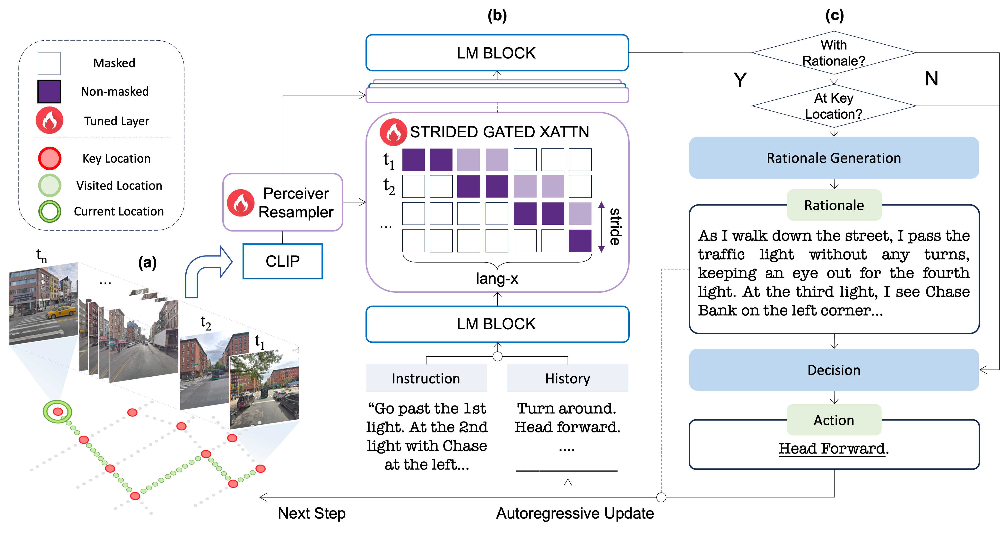
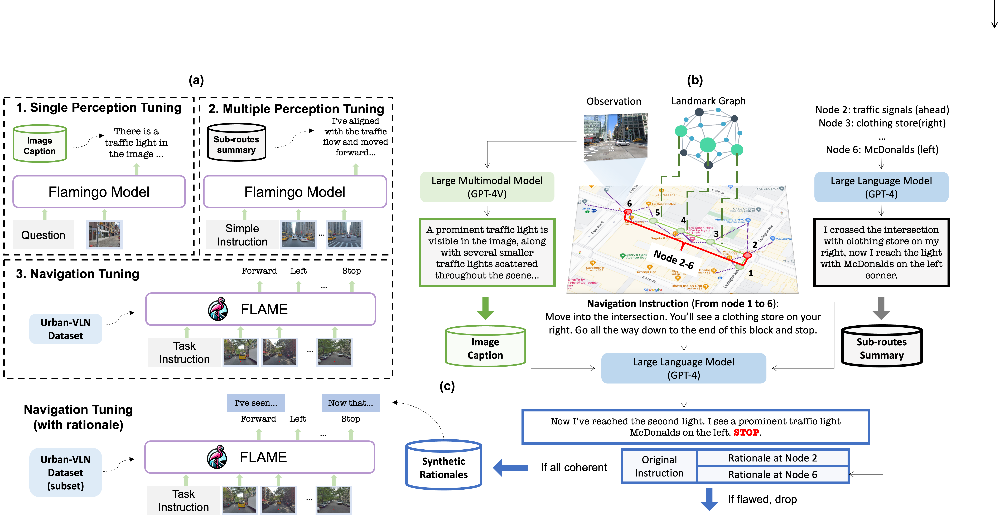

<p align="center" width="100%">

</p>

# FLAME (Flamingo-Architected Embodied Agent)

<a href="https://flame-sjtu.github.io"></a>
<a href="https://arxiv.org/"></a>
<a href="https://www.python.org/downloads/release/python-380/"></a>

This repository contains code for reproducing results. (will be released later)

## 📖 Table of Contents

* [👋 Overview](#-overview)
* [🤖️ Method Details](#-method-details)
* [🛠️ Training and Evaluation](#-training-and-evaluation)
## 👋 Overview
> Large Language Models (LLMs) have demonstrated potential in Vision-and-Language Navigation (VLN) tasks, yet current applications face challenges. While LLMs excel in general conversation scenarios, they struggle with specialized navigation tasks, yielding suboptimal performance compared to specialized VLN models. We introduce FLAME (FLAMingo-Architected Embodied Agent), a novel Multimodal LLM-based agent and architecture designed for urban VLN tasks that efficiently handles multiple observations. Our approach implements a three-phase tuning technique for effective adaptation to navigation tasks, including single perception tuning for street view description, multiple perception tuning for trajectory summarization, and end-to-end training on VLN datasets. The augmented datasets are synthesized automatically. Experimental results demonstrate FLAME's superiority over existing methods, surpassing state-of-the-art methods by a 7.3% increase in task completion rate on Touchdown dataset. This work showcases the potential of Multimodal LLMs (MLLMs) in complex navigation tasks, representing an advancement towards practical applications of MLLMs in embodied AI.

## 🤖 Method Details
<p float="left">
  
</p>

> Based on Flamingo, FLAME operates autoregressively and efficiently handles multiple perceptions without increasing context length, ensuring efficiency in end-to-end training and inference.

<p float="left">
  
</p>

> Our approach implements a three-phase tuning technique for effective adaptation to navigation tasks, including single perception tuning for street view description, multiple perception tuning for trajectory summarization, and end-to-end training on VLN datasets. The augmented datasets are synthesized automatically.

## 🛠️ Training and Evaluation
FLAME is implemented based on [Otter](https://github.com/Luodian/Otter) and [OpenFlamingo](https://github.com/mlfoundations/open_flamingo). The training is based on Deepspeed. Detailed modules of the code will be released later.

## 📊 Performance

FLAME achieves state-of-the-art results on both the Touchdown and Map2seq datasets. The table below highlights FLAME's performance compared to previous models.

### Touchdown Dataset

| Model | TC↑ (Dev) | SPD↓ (Dev) | nDTW↑ (Dev) | TC↑ (Test) | SPD↓ (Test) | nDTW↑ (Test) |
|-------|-----------|-----------|-----------|-----------|-----------|-----------|
| RCONCAT (2019) | 10.60 | 20.4 | 22.50 | 11.80 | 20.40 | 22.90 |
| GA (2019) | 12.00 | 18.70 | 25.20 | 11.90 | 19.00 | 24.90 |
| VLN-Trans (2021) | 15.00 | 20.30 | 27.00 | 16.20 | 20.80 | 27.80 |
| ARC+L2S (2020) | 19.48 | 17.05 | - | 16.68 | 18.84 | - |
| ORAR (2022) | 30.05 | 11.12 | 45.50 | 29.60 | 11.79 | 45.30 |
| VELMA (2023) | 29.83 | 14.67 | 43.44 | 27.38 | 15.03 | 41.93 |
| PM-VLN (2023) | 33.00 | 23.60 | - | 33.40 | 23.80 | - |
| VLN-Video (2024) | 34.50 | 9.60 | - | 31.70 | 11.20 | - |
| Loc4Plan (2024) | 34.50 | 10.50 | - | 32.90 | 11.50 | - |
| **FLAME** | **41.28** | **9.14** | **55.96** | **40.20** | **9.53** | **54.56** |

### Map2seq Dataset

| Model | TC↑ (Dev) | SPD↓ (Dev) | nDTW↑ (Dev) | TC↑ (Test) | SPD↓ (Test) | nDTW↑ (Test) |
|-------|-----------|-----------|-----------|-----------|-----------|-----------|
| RCONCAT (2019) | 17.10 | - | 30.70 | 14.70 | - | 27.70 |
| GA (2019) | 18.20 | - | 33.00 | 17.00 | - | 30.10 |
| VLN-Trans (2021) | 18.60 | - | 31.10 | 17.00 | - | 29.50 |
| ORAR (2022) | 49.88 | **5.87** | 62.70 | 47.75 | 6.53 | 62.10 |
| VELMA (2023) | 52.75 | 6.78 | 66.45 | 48.70 | 6.80 | 62.37 |
| Loc4Plan (2024) | 48.00 | 7.00 | - | 45.30 | 7.20 | - |
| **FLAME** | **56.95** | 5.95 | **71.36** | **52.44** | **5.91** | **67.72** |

FLAME consistently outperforms prior models, proving that MLLMs can significantly outperform specialized VLN models.

## Citation
If you find our research useful, please cite our [paper](https://arxiv.org/):

```
@article{xu2024flame,
        title={FLAME: Learning to Navigate with Multimodal LLM in Urban Environments},
        author={Xu, Yunzhe and Pan, Yiyuan and Liu, Zhe and Wang, Hesheng},
        year={2024}}
```

