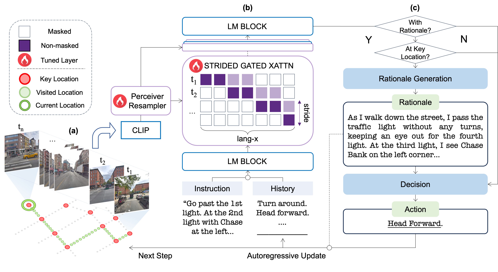
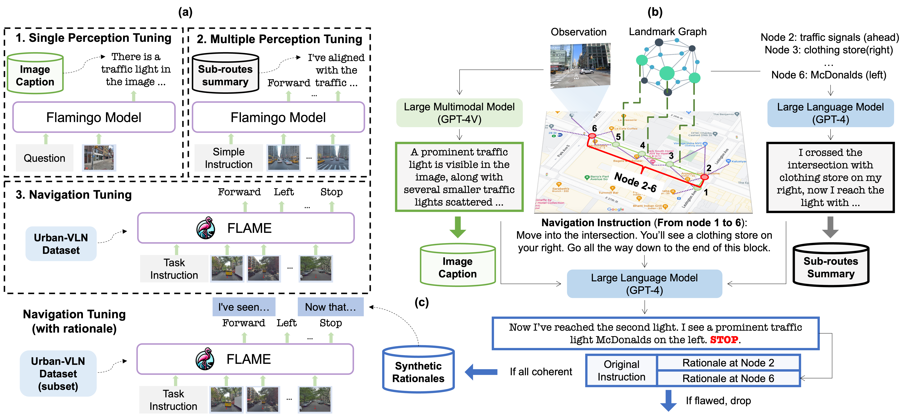

<p align="center" width="100%">

</p>

# FLAME (Flamingo-Architected Embodied Agent)

<a href="https://flame-sjtu.github.io"></a>
<a href="https://arxiv.org/abs/2408.11051"></a>
[](https://paperswithcode.com/sota/vision-and-language-navigation-on-touchdown?p=flame-learning-to-navigate-with-multimodal)
[](https://paperswithcode.com/sota/vision-and-language-navigation-on-map2seq?p=flame-learning-to-navigate-with-multimodal)

## 🔥 News (stay tuned for updates)

* **[2025.1.18]** Our paper has been selected for oral presentation at the conference.
* **[2024.12.27]** We release code for reproducing the SOTA results.
* **[2024.12.9]** Our paper is accepted by AAAI 2025.
* **[2024.8.20]** We release the [paper](https://arxiv.org/abs/2408.11051) and the [webpage](https://flame-sjtu.github.io) of our project.

## 📖 Table of Contents

* [👋 Overview](#-overview)
* [🤖️ Method Details](#-method-details)
* [🛠️ Implementation](#-implementation)
## 👋 Overview
> Large Language Models (LLMs) have demonstrated potential in Vision-and-Language Navigation (VLN) tasks, yet current applications face challenges. While LLMs excel in general conversation scenarios, they struggle with specialized navigation tasks, yielding suboptimal performance compared to specialized VLN models. We introduce FLAME (FLAMingo-Architected Embodied Agent), a novel Multimodal LLM-based agent and architecture designed for urban VLN tasks that efficiently handles multiple observations. Our approach implements a three-phase tuning technique for effective adaptation to navigation tasks, including single perception tuning for street view description, multiple perception tuning for route summarization, and end-to-end training on VLN datasets. The augmented datasets are synthesized automatically. Experimental results demonstrate FLAME's superiority over existing methods, surpassing state-of-the-art methods by a 7.3% increase in task completion on Touchdown dataset. This work showcases the potential of Multimodal LLMs (MLLMs) in complex navigation tasks, representing an advancement towards applications of MLLMs in the field of embodied intelligence.

## 🤖 Method Details
<p float="left">
  
</p>

> Based on Flamingo, FLAME operates autoregressively and efficiently handles multiple perceptions without increasing context length, ensuring efficiency in end-to-end training and inference.

<p float="left">
  
</p>

> Our approach implements a three-phase tuning technique for effective adaptation to navigation tasks, including single perception tuning for street view description, multiple perception tuning for simple navigation scenario and trajectory summarization, and end-to-end training on VLN datasets. The augmented datasets are synthesized automatically.

## 🛠️ Implementation
FLAME is implemented based on [Otter](https://github.com/Luodian/Otter) and [OpenFlamingo](https://github.com/mlfoundations/open_flamingo). The training is based on DeepSpeed. We provide code for end-to-end training (navigation tuning) and evaluation on the Touchdown and Map2seq datasets.

### Preparation
1. Create a dataset directory and install dependencies:

    ```setup
    mkdir dataset
    conda create --name flame python=3.10
    conda activate flame
    pip install -r requirements.txt
    ```

2. Download the outdoor VLN dataset from [Hugging Face](https://huggingface.co/datasets/xyz9911/Outdoor_VLN/tree/main) and place the downloaded data in the `dataset` folder. Unpack clip features from `touchdown_feature.tar` before use. (For the panoramas, you have to request and download from https://sites.google.com/view/streetlearn/dataset, though the provided clip features is sufficient for training and evaluation.)

3. (Optional) Download the pretrained checkpoint from [Hugging Face](https://huggingface.co/xyz9911/FLAME-init/tree/main) and place it in a custom folder. You need to specify the model_path in the training script.


### DeepSpeed Training
We provide several training scripts (in the 'scripts' folder) using DeepSpeed ZERO-1 by default:

**Basic Training (SOTA Results)**:
- `ds_ft_touchdown.sh`: Touchdown dataset
- `ds_ft_map2seq.sh`: Map2seq dataset

**Rationale Training**:
- `ds_ft_touchdown_rationale.sh`: Touchdown subset with rationales
- `ds_ft_map2seq_rationale.sh`: Map2seq subset with rationales

Usage:
```bash
# Single GPU (recommended)
bash scripts/ds_ft_touchdown.sh <GPU_ID>

# Multi-GPU (e.g., GPUs 0,1)
bash scripts/ds_ft_touchdown.sh <GPU_IDS>
```

Example:
```bash
bash scripts/ds_ft_touchdown.sh 0
```

### Full Precision (FP32/TF32) Training
For better stability or when DeepSpeed is not available:
```bash
python train_flame.py \
    --model_path </path/to/pretrained_model> \
    --train_if_data_path </path/to/ft_train_data> \
    --eval_if_data_path </path/to/ft_dev_data> \
    --dataset </path/to/data> \
    --img_db "dataset/touchdown_feature" \
    --batch_size 64 \
    --micro_batch_size 1 \
    --eval_data_size 128 \
    --env_batch_size 4 \
    --tf32 True \
    --learning_rate 1e-4 \
    --lr_scheduler_type "cosine" \
    --warmup_ratio 0.01 \
    --save_steps 100 \
    --eval_steps 100 \
    --num_train_epochs <epochs> \
```

### Evaluation

**Basic Evaluation**:
- `nav_touchdown.sh`: Touchdown dataset
- `nav_map2seq.sh`: Map2seq dataset

Usage:
```bash
bash scripts/nav_touchdown.sh <GPU_ID> <checkpoint_dir> <split> <checkpoint_numbers>
```

Example:
```bash
bash scripts/nav_touchdown.sh 0 checkpoints dev 1600 1700 1800
```

Parameters:
- `GPU_ID`: GPU ID
- `checkpoint_dir`: Directory containing checkpoints
- `split`: Dataset split (dev or test)
- `checkpoint_numbers`: Space-separated checkpoint steps to evaluate

**Evaluation with Self-Consistency**:
- `nav_touchdown_rationale.sh`: Touchdown subset with rationales
- `nav_map2seq_rationale.sh`: Map2seq subset with rationales

Usage:
```bash
bash scripts/nav_touchdown_rationale.sh <GPU_ID> <checkpoint_dir> <split> <temperature> <decoding_paths> <checkpoint_numbers>
```

Example:
```bash
bash scripts/nav_touchdown_rationale.sh 0 checkpoints 1.0 8 1600 1700 1800
```

Parameters:
- `temperature`: Controls prediction randomness (0.0 for deterministic)
- `decoding_paths`: Number of sampled trajectories

### Important Notes

#### Evaluation
- In-training evaluation uses a subset (10%) of validation data for efficiency
- Always perform full evaluation on saved checkpoints after training

#### Training
- When using DeepSpeed, apply early stopping around 2500 steps
- Learning rate defaults to 1e-4
- Batch size defaults to 64 in single-gpu mode (needs to be adjusted based on the world size)

#### Hardware
- BF16 training requires Ampere or newer GPUs
- For older GPUs:
  - Use FP16 with DeepSpeed
  - Or use full precision training with FP32

## 📊 Performance

FLAME achieves state-of-the-art results on both the Touchdown and Map2seq datasets. The table below highlights FLAME's performance compared to previous models.

### Touchdown Dataset

| Model | TC↑ (Dev) | SPD↓ (Dev) | nDTW↑ (Dev) | TC↑ (Test) | SPD↓ (Test) | nDTW↑ (Test) |
|-------|-----------|-----------|-----------|-----------|-----------|-----------|
| RCONCAT (2019) | 10.60 | 20.4 | 22.50 | 11.80 | 20.40 | 22.90 |
| GA (2019) | 12.00 | 18.70 | 25.20 | 11.90 | 19.00 | 24.90 |
| VLN-Trans (2021) | 15.00 | 20.30 | 27.00 | 16.20 | 20.80 | 27.80 |
| ARC+L2S (2020) | 19.48 | 17.05 | - | 16.68 | 18.84 | - |
| ORAR (2022) | 30.05 | 11.12 | 45.50 | 29.60 | 11.79 | 45.30 |
| VELMA (2023) | 29.83 | 14.67 | 43.44 | 27.38 | 15.03 | 41.93 |
| PM-VLN (2023) | 33.00 | 23.60 | - | 33.40 | 23.80 | - |
| VLN-Video (2024) | 34.50 | 9.60 | - | 31.70 | 11.20 | - |
| Loc4Plan (2024) | 34.50 | 10.50 | - | 32.90 | 11.50 | - |
| **FLAME** | **41.28** | **9.14** | **55.96** | **40.20** | **9.53** | **54.56** |

### Map2seq Dataset

| Model | TC↑ (Dev) | SPD↓ (Dev) | nDTW↑ (Dev) | TC↑ (Test) | SPD↓ (Test) | nDTW↑ (Test) |
|-------|-----------|-----------|-----------|-----------|-----------|-----------|
| RCONCAT (2019) | 17.10 | - | 30.70 | 14.70 | - | 27.70 |
| GA (2019) | 18.20 | - | 33.00 | 17.00 | - | 30.10 |
| VLN-Trans (2021) | 18.60 | - | 31.10 | 17.00 | - | 29.50 |
| ORAR (2022) | 49.88 | **5.87** | 62.70 | 47.75 | 6.53 | 62.10 |
| VELMA (2023) | 52.75 | 6.78 | 66.45 | 48.70 | 6.80 | 62.37 |
| Loc4Plan (2024) | 48.00 | 7.00 | - | 45.30 | 7.20 | - |
| **FLAME** | **56.95** | 5.95 | **71.36** | **52.44** | **5.91** | **67.72** |

FLAME consistently outperforms prior models, proving that MLLMs can significantly outperform specialized VLN models.

## 💝 Acknowledgements

We sincerely thank the [Otter](https://github.com/Luodian/Otter) team and the [OpenFlamingo](https://github.com/mlfoundations/open_flamingo) team for their great contribution to the Flamingo-architected Multimodal Large Language Models.

## Citation
If you find our research useful, please cite our [paper](https://arxiv.org/abs/2408.11051):

```
@article{xu2024flame,
        title={FLAME: Learning to Navigate with Multimodal LLM in Urban Environments},
        author={Xu, Yunzhe and Pan, Yiyuan and Liu, Zhe and Wang, Hesheng},
        journal={arXiv preprint arXiv:2408.11051},
        year={2024}}
```
